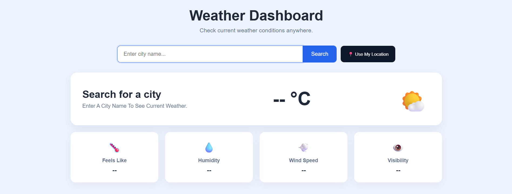
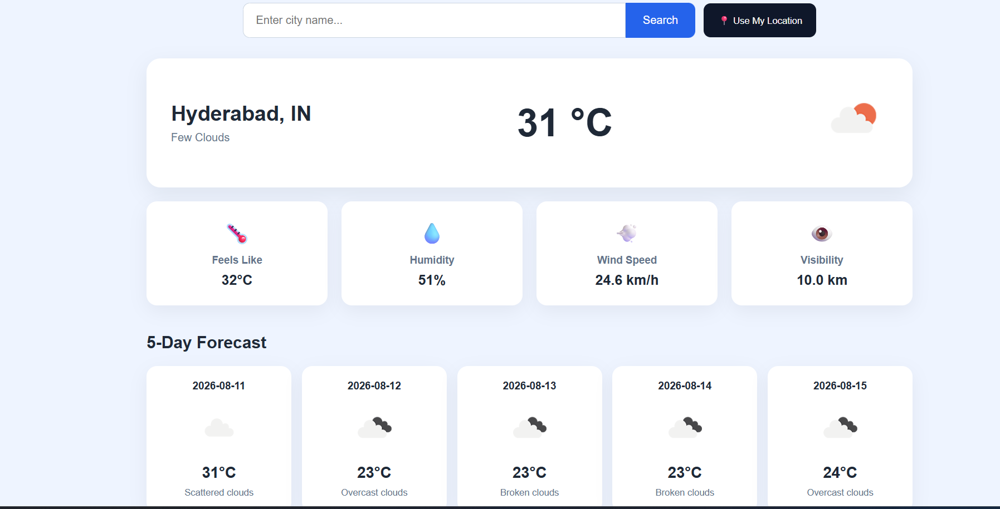

# 🌦️ Weather Dashboard

A responsive weather dashboard built with Python, Flask, JavaScript, and the OpenWeather API. The application allows users to search for a city, view current weather conditions, and check upcoming forecast information through a simple and responsive interface.

🔗 **Live Demo:** https://weather-dashboard-1-witx.onrender.com

---

## 📌 Overview

The Weather Dashboard is a web application developed using Python and Flask.

Users can search for a city and retrieve real-time weather information through the OpenWeather API. The application also supports browser-based location detection, allowing users to retrieve weather information based on their current location.

The project was developed incrementally, tested locally, version-controlled using Git and GitHub, and deployed to Render using Gunicorn.

---

## ✨ Features

- 🔎 Search weather by city name
- 📍 Get weather using the user's current browser location
- 🌡️ Display current temperature
- 🌤️ Display current weather conditions
- 💧 Display humidity information
- 💨 Display wind information
- 📅 Display upcoming weather forecast
- ⏳ Display a loading state while weather data is being retrieved
- ⚠️ Handle API and request errors
- 📱 Responsive user interface
- 🔐 Store the API key securely using environment variables
- ☁️ Deployed online using Render

---

## 📸 Screenshots

### Dashboard



### Weather Search Result and Forecast



---

## 🛠️ Technologies Used

### Backend

- Python
- Flask
- Requests
- python-dotenv
- Gunicorn

### Frontend

- HTML5
- CSS3
- JavaScript

### API

- OpenWeather API

### Development & Deployment

- Git
- GitHub
- Render

---

## 🏗️ Project Structure

```text
Weather-Dashboard/
│
├── screenshots/
│   ├── dashboard.png
│   └── weather-result.png
│
├── static/
│   ├── css/
│   │   └── style.css
│   └── js/
│       └── script.js
│
├── templates/
│   └── index.html
│
├── .gitignore
├── app.py
├── README.md
└── requirements.txt
```

---

## ⚙️ How It Works

The application follows this general workflow:

```text
User enters a city
        ↓
Frontend sends a request to Flask
        ↓
Flask processes the request
        ↓
Flask requests weather data from OpenWeather API
        ↓
Weather data is received
        ↓
Flask returns the response
        ↓
JavaScript updates the dashboard
```

### Location-Based Weather

The application can also retrieve weather information using the browser's geolocation functionality.

```text
User clicks "Use My Location"
        ↓
Browser requests location permission
        ↓
Latitude and longitude are obtained
        ↓
Frontend sends the coordinates to Flask
        ↓
Flask requests weather information
        ↓
Weather data is displayed
```

---

## 🔐 Environment Variables

The OpenWeather API key is stored using an environment variable rather than being written directly into the application source code.

For local development, create a `.env` file in the project root:

```env
OPENWEATHER_API_KEY=your_api_key_here
```

Replace `your_api_key_here` with your own OpenWeather API key.

### Security

The `.env` file should **not** be committed to GitHub.

The production API key is configured separately through the Render environment variables.

---

## 🚀 Running the Project Locally

### 1. Clone the repository

```bash
git clone https://github.com/nikilthecode/Weather-Dashboard.git
```

### 2. Navigate to the project directory

```bash
cd Weather-Dashboard
```

### 3. Create a virtual environment

On Windows:

```powershell
python -m venv .venv
```

### 4. Activate the virtual environment

For PowerShell:

```powershell
.venv\Scripts\Activate.ps1
```

### 5. Install dependencies

```bash
pip install -r requirements.txt
```

### 6. Configure the OpenWeather API key

Create a `.env` file in the project root:

```env
OPENWEATHER_API_KEY=your_api_key_here
```

Replace the placeholder with your actual OpenWeather API key.

### 7. Run the application

```bash
python app.py
```

The Flask application will start locally. Open the local address displayed in your terminal in a web browser.

---

## ☁️ Deployment

The Weather Dashboard is deployed using Render.

Gunicorn is used as the production WSGI server instead of Flask's built-in development server.

### Build Command

```text
pip install -r requirements.txt
```

### Start Command

```text
gunicorn app:app
```

### Environment Variable

The following environment variable is configured in Render:

```text
OPENWEATHER_API_KEY
```

The API key itself is not stored in the public GitHub repository.

### Live Application

https://weather-dashboard-1-witx.onrender.com

---

## 🧪 Testing

The application was tested locally before deployment.

Testing included:

- Searching for valid city names
- Searching for invalid city names
- Retrieving current weather information
- Retrieving forecast information
- Testing browser-based location detection
- Testing loading states
- Testing API request failures
- Testing error responses
- Checking the responsive interface
- Testing the deployed application after deployment

The deployed application was tested to verify that the main weather search and forecast functionality works correctly.

---

## ⚠️ Error Handling

The application includes handling for common request and API-related problems, including:

- Invalid city names
- Failed API requests
- Weather API errors
- Location request failures
- Unexpected API responses
- Unavailable forecast data
- Loading states while requests are being processed

These checks help provide users with a better experience when weather information cannot be retrieved successfully.

---

## 🔮 Future Improvements

Possible future enhancements include:

- 🌙 Dark and light theme
- ⭐ Favorite cities
- 🌡️ Temperature unit switching
- 📊 Weather data visualization
- 🗺️ Interactive weather maps
- 🕐 Recent city search history
- 🌅 Sunrise and sunset information
- 📱 Progressive Web App support
- ♿ Improved accessibility
- 🧪 Automated tests

---

## 📚 What I Learned

Through this project, I practiced:

- Building web applications with Flask
- Working with REST APIs
- Sending and handling HTTP requests
- Processing JSON API responses
- Connecting JavaScript with Flask routes
- Using browser geolocation
- Managing environment variables securely
- Handling API and request errors
- Creating responsive interfaces using HTML and CSS
- Using Git for version control
- Managing a project using GitHub
- Preparing a Flask application for production
- Using Gunicorn as a production WSGI server
- Deploying a Python application using Render

---

## 👤 Author

**Teja**

MCA Student | Python & Web Development

GitHub: https://github.com/nikilthecode

---

## 📄 License

This project was created for educational and portfolio purposes.
